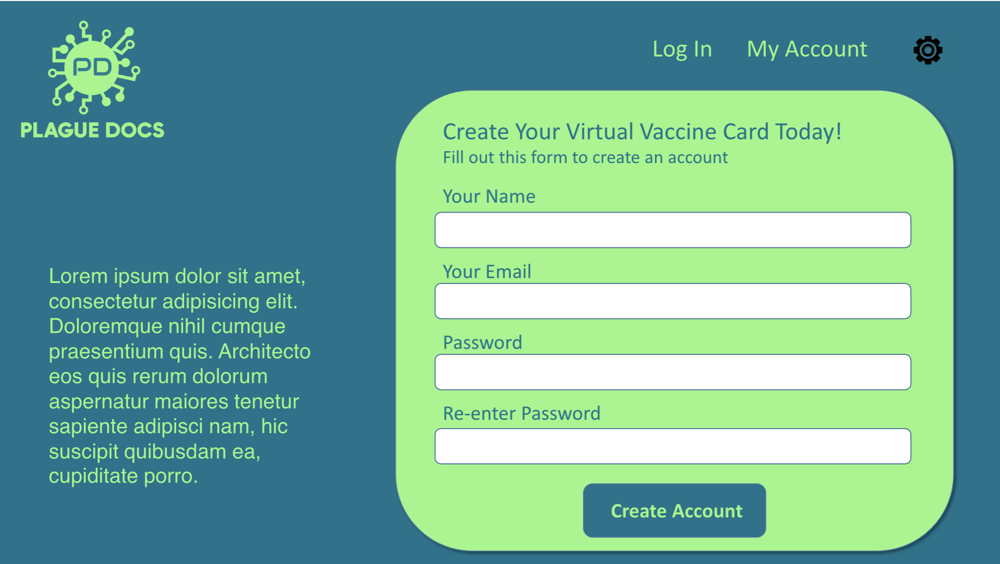

# Plague Docs

If you’ve lived on earth for the past two years, then you are well aware of everything that’s happened here lately! If you’ve received the coronavirus vaccine, you need to carry your card around when you travel or go places… right? Not anymore! Introducing Plague Docs: the new app that carries your vaccine card FOR you!  

   

## Table of Contents

* [Technologies](#Technologies)
* [Story](#Story)
* [Criteria](#Criteria)
* [Credits](#Credits)
* [Screenshots](#Screenshots)
* [FutureDev](#FutureDev)
* [Deployment&Repository](#Deployment&Repository)

## Technologies

* MongoDB, Express, React, Node – the MERN stack
* Mongoose, GraphQL, Jest, Semantic UI-React, npm
* Paradigms used in app construction: Object-Oriented Programming, Model-View-Controller

## Story

AS A Vaccinated User  
I WANT my COVID vaccination information in my virtual wallet  
SO THAT I do not have to carry around the physical card

## Criteria

* _GIVEN_ an application for vaccination input
* _WHEN_ I open the app
* _THEN_ I am requested to create an account with my full name email address  
* _WHEN_ I enter my information 
* _THEN_ I am prompted to create a password and to verify the password
* _WHEN_ I click submit 
* _THEN_ I am requested to to input COVID vaccination information (type,dates,facility location, facility contact)
* _WHEN_ I click submit 
* _THEN_ I am prompted to upload or take a photo of my COVID Vaccination card
* _WHEN_ I click submit
* _THEN_ I am asked if I'd like to save or add a family member
* _WHEN_ save is selected 
* _THEN_ the card is added to the virtual wallet
* _WHEN_ add a family member is selected 
* _THEN_ the app goes through the prompts to input COVID vaccination information until save is selected

## Credits

* Kat Redondo
    - MongoDB, Queries, Mutations
    - [GITHUB](https://github.com/ru3ykat)
* Vanessa Sylverain
    - GraphQL with Node and Express
    - [GITHUB](https://github.com/sylverainv)
* Christi Marchetti
    - React Front-end
    - [GITHUB](https://github.com/chl850405)
* Gabrielle Donald
    - React Front-end
    - [GITHUB](https://github.com/gabriellenoelle)
* Kevin Stewart
    - Authentication, JWT, Protect API Key, Deployment
    - [GITHUB](https://github.com/stewk033)

## Screenshots

## FutureDev

* Build Models to represent further patient data, such as: 
  => Health Insurance Cards 
  => ICE (In Case of Emergency) Details 
  => Childhood Vaccinations and Boosters 
  => Patient Conditions 
  => Patient Medications/Supplements  
* Build Documents containing compiled Household Adults and Children via references, providing for Notifications (via push, email, or text): 
  => set up by Adult users for health-related reminders (appointments) 
  => from application for vaccination dose/booster reminders 
  => from local health authorities for safety requirements (masks, vaccination status) 
  => from local resources concerning vaccination, treatment, or healthcare location availability 
  => from CDC regarding current illness, variants of concern, recommended procedures  
* Establish Fields in Household Documents for contact tracing, to help prevent the spread of current or future infectious diseases:  
  => Adapting resources (e.g. Google Maps) to trace patient travel and contacts over a recent, incubation time-reflective, time period 
  => Self-monitored and reported potentially infectious interactions, exposures, and symptoms of disease (via checkbox, write-in) 
  => Local health department guidance and assistance for patient isolation 
  => Inform associated Household contacts of their exposures, provide risk assessments, symptom red flags, and instructions for next steps 
  => Provide daily check-in surveys of symptoms for monitoring and follow-ups 
  => Sharing of community resources for mental health associated with illness/loss  
* Provide data from and to high-risk/priority situations and patients in:<br/ 
  => Health care (including long-term care) facilities 
  => Student housing 
  => Homeless shelters 
  => Correctional facilities

## Deployment&Repository

Live URL: https://plague-docs.herokuapp.com/  
GitHub Repository: https://github.com/stewk033/plague-docs
